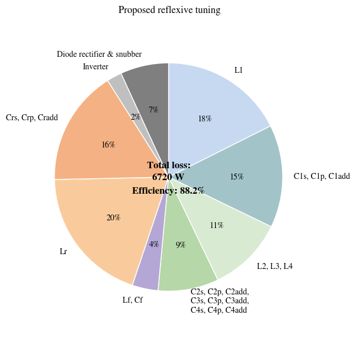
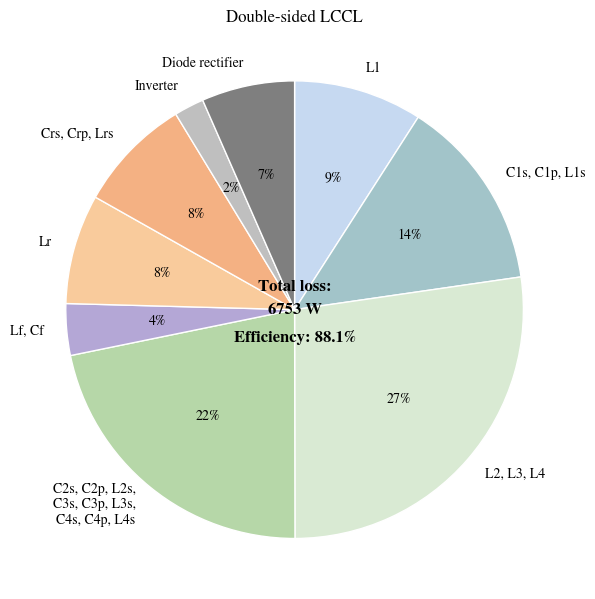

# 50 kW Reflexive Tuning Networks - Loss Breakdown Analysis

## 📄 Overview

This repository contains the loss analysis code for the IEEE Open Journal of Power Electronics paper:

**"50 kW Reflexive Tuning Networks With Low Uncoupled Transmitter Currents for Dynamic Inductive Power Transfer Systems"**

- **Journal**: IEEE Open Journal of Power Electronics
- **DOI**: 10.1109/OJPEL.2024.3379846
- **Authors**: Shuntaro Inoue, Samuel Kiguthi, Jonathan Newman, Timothy Goodale, Chakridhar Reddy Teeneti, Bryce Hesterman, Abhilash Kamineni, and Regan Andrew Zane

## 🔬 Research Background

### Problem Statement
In Dynamic Wireless Power Transfer (DWPT) systems, the coupling coefficient varies significantly as vehicles move. Conventional Double LCCL topology suffers from high currents flowing through uncoupled transmitter coils, leading to efficiency degradation.

### Proposed Solution: Reflexive Tuning
- **Adaptive Coupling Control**: Adjusts reflected reactance based on coupling conditions
- **Uncoupled Current Reduction**: Achieves 37% current reduction
- **System Efficiency Improvement**: Reaches 90% DC-DC efficiency (50 kW, 85 kHz)

## 📁 Repository Structure

### Jupyter Notebooks
- **`LossBreakDown_50kW_ReflexiveTuning.ipynb`**: Reflexive Tuning analysis (Paper Fig. 21(a))
- **`LossBreakdown_50kW_Double_LCCL.ipynb`**: Conventional Double LCCL analysis (Paper Fig. 21(b))

### Data Files
- **`LossBreakdown_Reflexive.xlsx`**: Reflexive Tuning analysis results
- **`LossBreakdown_LCCL.xlsx`**: Double LCCL analysis results
- **`MagneticParameters.xlsx`**: System parameters

## 🚀 Quick Start

### Prerequisites
```bash
pip install pandas numpy matplotlib seaborn openpyxl
```

### Usage
1. **Clone the repository**
2. **Launch Jupyter Notebook**
3. **Run the notebooks**
   - `LossBreakDown_50kW_ReflexiveTuning.ipynb`: Novel method analysis
   - `LossBreakdown_50kW_Double_LCCL.ipynb`: Conventional method comparison

## 📊 Analysis Results

### Loss Breakdown (Paper Fig. 21)

The code generates two detailed loss distribution pie charts as shown in Fig. 21 of the paper:

#### Fig. 21(a) - Reflexive Tuning


**Key Components**:
- **L1**: Main transmitter coil loss
- **C1s, C1p, C1add**: Primary side capacitor losses
- **L2, L3, L4**: Uncoupled transmitter coil losses (3 systems)
- **C2s-C4s, C2p-C4p, C2add-C4add**: Uncoupled capacitor losses
- **Lf, Cf**: Filter losses
- **Lr**: Receiver coil loss
- **Crs, Crp, Cradd**: Secondary side capacitor losses
- **Inverter**: Switching losses
- **Diode rectifier & snubber**: Rectification and snubber losses

#### Fig. 21(b) - Double LCCL


**Key Components**:
- **L1**: Main transmitter coil loss
- **C1s, C1p, C1add**: Primary side capacitor losses
- **L2, L3, L4**: Uncoupled transmitter coil losses (3 systems)
- **C2s-C4s, C2p-C4p, C2add-C4add**: Uncoupled capacitor losses
- **Lf, Cf**: Filter losses
- **Lr**: Receiver coil loss
- **Crs, Crp, Cradd**: Secondary side capacitor losses
- **Inverter**: Switching losses
- **Diode rectifier & snubber**: Rectification and snubber losses


## 🔧 Technical Details

### System Specifications
```python
Pout = 50000  # 50 kW
f = 85e3      # 85 kHz
Vdc = 400     # 400 V
Vbat = 400    # 400 V
QL = 400      # Inductor quality factor
QC = 500      # Capacitor quality factor
```


### LCCL Theoretical Foundation
Double LCCL analysis uses theoretical equations from:

**"Fast Design Optimization Method Utilizing a Combination of Artificial Neural Networks and Genetic Algorithms for Dynamic Inductive Power Transfer Systems"**
- **Journal**: IEEE Open Journal of Power Electronics
- **DOI**: 10.1109/OJPEL.2022.3224422

## 🎯 Applications

### Research Applications
- **Academic Research**: Understanding Reflexive Tuning principles
- **System Design**: Reference for similar WPT system design
- **Performance Analysis**: Loss analysis methodology learning
- **Optimization Studies**: Parameter optimization framework

### Industry Applications
- **EV Charging**: Dynamic wireless charging system design
- **Industrial WPT**: High-power wireless power transfer
- **System Integration**: Component selection and sizing
- **Performance Validation**: Experimental result comparison

## 📚 Educational Value

This repository is suitable for learning:
- **Power Electronics**: Resonant converter design
- **Wireless Power Transfer**: Dynamic WPT system analysis
- **Loss Analysis**: Comprehensive loss modeling
- **System Optimization**: Multi-parameter optimization
- **Research Methodology**: Academic paper implementation

## 📝 Citation

Please cite the following papers when using this code:

```bibtex
@article{inoue2024reflexive,
  title={50 kW Reflexive Tuning Networks With Low Uncoupled Transmitter Currents for Dynamic Inductive Power Transfer Systems},
  author={Inoue, Shuntaro and Kiguthi, Samuel and Newman, Jonathan and Goodale, Timothy and Teeneti, Chakridhar Reddy and Hesterman, Bryce and Kamineni, Abhilash and Zane, Regan Andrew},
  journal={IEEE Open Journal of Power Electronics},
  year={2024},
  doi={10.1109/OJPEL.2024.3379846}
}

@article{inoue2022fast,
  title={Fast Design Optimization Method Utilizing a Combination of Artificial Neural Networks and Genetic Algorithms for Dynamic Inductive Power Transfer Systems},
  author={Inoue, Shuntaro and Goodrich, Dakota and Saha, Shaju and Nimri, Reebal and Kamineni, Abhilash and Flann, Nicholas S.},
  journal={IEEE Open Journal of Power Electronics},
  volume={3},
  pages={915--929},
  year={2022},
  doi={10.1109/OJPEL.2022.3224422}
}
```
## 📄 License

MIT License - see [LICENSE](LICENSE) file for details

## 📞 Contact

- **Author**: Shuntaro Inoue
- **Email**: shuntaro@ieee.org
- **Institution**: Utah State University

---

**Note**: This code is provided as supplementary material to enhance understanding of the paper. For complete theoretical background and experimental validation, please refer to the original papers. 
